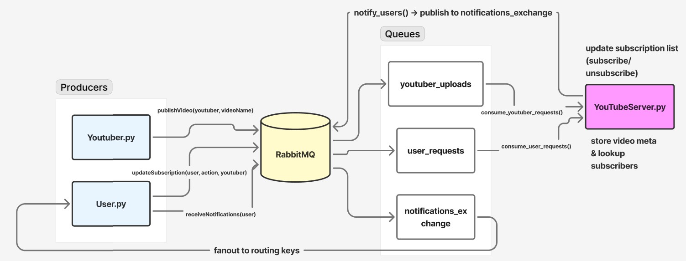

# 📺 Distributed YouTube Notification System  
A scalable, event-driven architecture built using **RabbitMQ** to simulate YouTube-like interactions between **YouTubers**, **Users**, and a central **YouTube Server**. This system supports concurrent uploads, subscriptions, and real-time notifications.

---

## 🚀 Overview  
This system enables:

- **YouTubers** to upload videos  
- **Users** to subscribe/unsubscribe to YouTubers  
- **A central YouTubeServer** to manage the entire workflow  
- **Real-time notifications** for new video uploads  

All communication happens through **RabbitMQ message queues**, allowing asynchronous, scalable, and concurrent interactions.

---

## 🧱 System Components

### 🔷 1. `YouTubeServer.py`  
The core backend service that orchestrates communications between users and YouTubers.

#### **Key Responsibilities**
- Handle login, subscription, and unsubscription messages from users.  
- Handle video upload messages from YouTubers.  
- Notify subscribed users whenever a YouTuber uploads a new video.

#### **Main Methods**
- **`consume_user_requests()`**  
  Listens for user actions such as login, subscribe, and unsubscribe.  
  Prints server-side logs when user actions occur.

- **`consume_youtuber_requests()`**  
  Listens for video upload events from YouTubers.  
  Prints details upon receiving a new video.

- **`notify_users()`**  
  Sends video upload notifications to all users subscribed to the respective YouTuber.

---

### 🔷 2. `Youtuber.py`  
A client-side script representing a YouTuber uploading videos.

#### **Main Method**
- **`publishVideo(youtuber, videoName)`**  
  Sends a message to `YouTubeServer.py` indicating a new video upload.  
  Returns **"SUCCESS"** when the message is successfully transmitted.

#### **Features**
- Easy video upload interface  
- Non-blocking communication via RabbitMQ  
- Supports running multiple YouTubers concurrently  

---

### 🔷 3. `User.py`  
A client-side script representing regular users of the platform.

#### **Main Methods**
- **`updateSubscription(user, action, youtuber)`**  
  Sends subscription/unsubscription requests to the server.  
  Prints **"SUCCESS"** when the request is processed.

- **`receiveNotifications(user)`**  
  Listens for notifications sent by the server.  
  Prints new video alerts **in real time**.

#### **Capabilities**
- User login  
- Subscribe or unsubscribe from YouTubers  
- Continuous live notification stream  

---

## 🔄 Flow of Service

### 1️⃣ **Start `YouTubeServer.py`**
- Initializes communication channels  
- Creates RabbitMQ queues for:
  - User login
  - Subscription/unsubscription
  - Video uploads  
- Begins listening for user and YouTuber events

---

### 2️⃣ **Run `Youtuber.py`**
- YouTubers upload videos  
- Video upload request is sent to the server  
- Server logs and acknowledges the upload  
- YouTuber receives **"SUCCESS"** response  

---

### 3️⃣ **Run `User.py`**
- Users log in via RabbitMQ  
- Subscribe/unsubscribe from YouTubers  
- Start real-time notification listener  
- Receive alerts instantly when subscribed YouTubers upload new videos  

---

### 4️⃣ **Concurrent Execution**
- Multiple YouTubers can upload videos simultaneously  
- Multiple users can subscribe, unsubscribe, and receive notifications at the same time  
- RabbitMQ ensures:
  - asynchronous communication  
  - message durability  
  - scalable load distribution  

---

## 📡 Architecture Benefits

- **Asynchronous processing** via RabbitMQ  
- **Real-time notifications** for subscribed users  
- **High concurrency** supported by message queues  
- **Loose coupling** between server, YouTubers, and users  
- **Scalable and extensible** for larger systems  

---

## 🧭 Summary  
This distributed YouTube-like system uses RabbitMQ to seamlessly connect users and content creators. It supports:

- Real-time event propagation  
- Concurrent communication  
- Clear role separation  
- Fault-tolerant asynchronous messaging  

Perfect for simulating large-scale notification systems or understanding event-driven architecture patterns.

---

