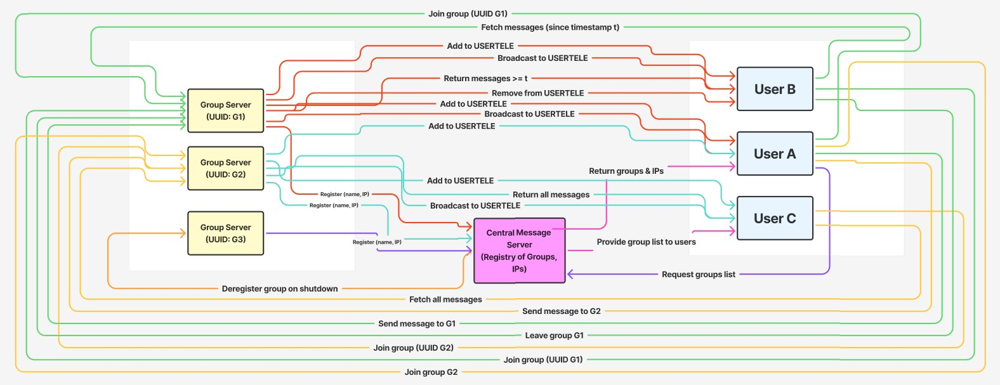

# 📡 Distributed Group Messaging System  
A scalable, concurrent messaging architecture built around a **central message server**, multiple **group servers**, and many **users** interacting across groups. This system enables dynamic group registration, message exchange, concurrency, and efficient message retrieval.

---

## 🚀 Overview  
This architecture implements a distributed messaging ecosystem where:

- A **central Message Server** manages all active groups.  
- **Group Servers** handle messaging, users, and persistence for each group.  
- **Users** can join multiple groups, send messages, and fetch message history.

The design emphasizes **scalability**, **concurrency**, and **robust communication** between all components.

---

## 🧱 System Components

### 🔷 1. Central Message Server  
The hub of the system responsible for:

- Maintaining a list of all **active group servers** (name + IP address).
- Registering new group servers.
- Serving clients (users) when they request the list of available groups.

**Key Responsibilities**
- Group registration  
- Group lookup  
- Acting as the initial contact point for all users  

---

### 🔷 2. Group Servers  
Each group server is responsible for one messaging group, uniquely identified by a **UUID**.

**Features**
- Manage group membership (`USERTELE` list).  
- Store and deliver messages with timestamps.  
- Handle concurrent user interactions using **threads**.  
- Process user actions: join, leave, send, retrieve messages.

**Message Persistence**
- Messages are stored in memory and remain available regardless of users joining/leaving.

---

### 🔷 3. Users  
Users interact both with the **central server** and with individual **group servers**.

**Capabilities**
- Join multiple groups simultaneously.  
- Leave groups at any time.  
- Send messages to any group they belong to.  
- Fetch message histories (optionally filtered by timestamps).  

---

## 🔄 Operational Flow

### 🧍‍♂️ User ↔ Message Server
- Request list of available groups.
- Discover group UUIDs and connection addresses.

### 🧍‍♂️ User ↔ Group Server
#### ✔ Join Group  
- User requests to join by providing the group UUID.
- Group validates and adds the user to `USERTELE`.

#### ✔ Leave Group  
- User requests to leave.
- Group removes the user from its member list.

#### ✔ Send Message  
- User sends a message to the group server.
- Group verifies membership.
- Message saved with timestamp and distributed to clients upon request.

#### ✔ Retrieve Messages  
- User provides a timestamp to fetch only newer messages.
- If no timestamp is provided → all messages returned.

### 🧩 Group Server ↔ Central Message Server
- Group servers announce their existence.
- Message server records group name + IP for user lookup.

---

## 🧵 Concurrency Model  
Group servers use **threads** to handle simultaneous user actions such as:

- Multiple users joining or leaving concurrently  
- Parallel message requests  
- Message sending while histories are being fetched  

This ensures performance and responsiveness even under heavy load.

---

## 🛡 Error Handling  
Every critical operation returns a **success or failure response**:

- Joining a group  
- Leaving a group  
- Sending a message  
- Fetching a message history  

This improves reliability and helps users and clients respond gracefully to failures.

---

## 📈 Scalability & Design Strengths

- **Horizontal scaling**: Add more group servers as needed.  
- **Distributed load**: Group servers manage their own messages and members.  
- **Fault tolerance**: Message server maintains active group registry; group servers retain message history.  
- **Flexible user participation**: Users can join any number of groups.  

---

## 🧭 Summary  
This messaging architecture combines a **centralized directory** with **distributed group management**, delivering:

- Efficient message exchange  
- Concurrent user operations  
- Scalable and flexible group-based messaging  
- Robust error handling  
- Real-time user interaction  

A well-balanced system ideal for distributed chat applications, collaborative environments, and multi-channel communication platforms.

---

